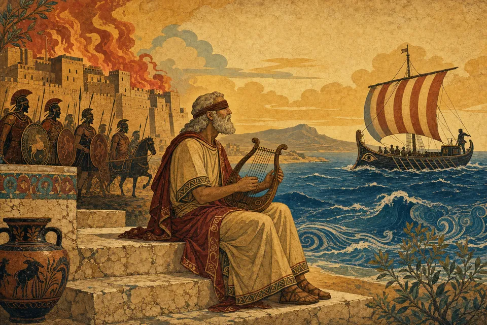

# Homers Epen – Ilias & Odyssee

**Eine mehrsprachige, interaktive Bildungswebsite über die beiden Homer zugeschriebenen Epen.**

🔗 **Live:** https://arkuksin.github.io/homer-epics/

Die Website führt wie eine moderne digitale Ausstellung durch Ilias und Odyssee: historisch fundiert, erzählerisch aufbereitet und vollständig in **Deutsch, Englisch und Russisch** verfügbar.



## Funktionsübersicht

- **Startseite** mit Einführung zu Homer, zeitlicher Einordnung, mündlicher Überlieferung und Werkauswahl
- **Ilias** und **Odyssee** als eigenständige Bereiche mit eigener visueller Identität (warm/terrakotta bzw. maritim/blau): Entstehung, Hintergrund, Handlung, Götter, Themen, Wirkungsgeschichte
- **Geführte Werkreisen** durch alle 24 Gesänge/Bücher beider Epen – mit Etappen-Zeitleiste, Kapitelnavigation, Lesefortschritt, markierten Wendepunkten und aufklappbaren Hintergrundnotizen
- **Figurenübersicht** mit 27 Figuren, Filtern nach Zugehörigkeit/Werk und einer **interaktiven Beziehungskarte** (SVG)
- **Orte & Reiseroute**: stilisierte Karte mit der Route des Odysseus; jede Station ist als *historisch*, *mythisch* oder *umstritten* gekennzeichnet
- **Vergleich** beider Epen in elf Aspekten (Handlung, Erzählstruktur, Heldenbild, Götter, Wirkung …)
- **Durchsuchbares Glossar** mit über 30 Begriffen in vier Kategorien
- **Quellen & weiterführende Literatur** mit seriösen, sprachspezifisch angepassten Empfehlungen
- Dreisprachigkeit mit Sprachumschalter, `localStorage`-Persistenz und Browsersprachen-Erkennung
- Barrierefreiheit: semantisches HTML, Tastaturbedienung, sichtbare Fokuszustände, `prefers-reduced-motion`, Alt-Texte in allen Sprachen
- SEO: sprachabhängige Titel/Beschreibungen, Open Graph, Social-Preview-Bild, Sitemap, robots.txt, 404-Fallback

## Tech-Stack

| Bereich | Technologie |
| --- | --- |
| UI | React 19, TypeScript (strict) |
| Build | Vite 7 |
| Routing | React Router 7 (`BrowserRouter` + GitHub-Pages-SPA-Fallback) |
| Styling | Strukturiertes modernes CSS (Custom Properties, `color-mix`, Container-freundliche Layouts) |
| Schriften | Cormorant Variable (Display) & Literata Variable (Fließtext), jeweils mit Kyrillisch-Subset, selbst gehostet via Fontsource |
| Bilder | KI-generiert über OpenAI **Codex CLI**, optimiert zu responsivem WebP via `sharp` |
| Tests | Playwright (Desktop + Mobile) |
| Deployment | GitHub Actions → GitHub Pages |

## Lokale Installation

```bash
git clone https://github.com/arkuksin/homer-epics.git
cd homer-epics
npm install
```

## Entwicklungsbefehle

```bash
npm run dev        # Entwicklungsserver (http://localhost:5173/homer-epics/)
npm run build      # Produktions-Build (Typprüfung + Vite-Build nach dist/)
npm run preview    # Vorschau des Produktions-Builds (http://localhost:4173/homer-epics/)
npm run test:e2e   # Playwright-End-to-End-Tests (nutzt den Preview-Server)
```

Für die E2E-Tests einmalig Browser installieren: `npx playwright install chromium webkit`.

## GitHub-Pages-Deployment

Das Deployment läuft automatisch über GitHub Actions ([.github/workflows/deploy-pages.yml](.github/workflows/deploy-pages.yml)):

1. Push auf `main` löst den Workflow aus.
2. Der Workflow installiert Abhängigkeiten, baut mit `npm run build` und veröffentlicht `dist/` über `actions/deploy-pages`.
3. In den Repository-Einstellungen muss **Pages → Source: GitHub Actions** aktiviert sein.

Der Vite-Base-Path ist in [vite.config.ts](vite.config.ts) auf `/homer-epics/` gesetzt. Client-seitiges Routing auf GitHub Pages funktioniert über [public/404.html](public/404.html), das den angeforderten Pfad in `sessionStorage` ablegt und zur App umleitet (SPA-Fallback).

## Mehrsprachigkeit

- Sprachen: **Deutsch (de), Englisch (en), Russisch (ru)** – vollständig, ohne Sprachmischung.
- Kleine UI-Strings (Navigation, Buttons, Metadaten) liegen statisch in [src/i18n/ui.ts](src/i18n/ui.ts).
- Der umfangreiche redaktionelle Inhalt liegt pro Sprache in [src/content/de|en|ru/](src/content) und wird **dynamisch nachgeladen** (Code-Splitting: nur die aktive Sprache wird geladen).
- Die Typen in [src/content/types.ts](src/content/types.ts) erzwingen strukturgleiche Inhalte in allen Sprachen.
- Spracherkennung: gespeicherte Wahl (`localStorage`) → Browsersprache → Englisch als Fallback. Das `lang`-Attribut des Dokuments wird dynamisch gesetzt.
- Eigennamen folgen der jeweils üblichen Schreibtradition (z. B. Achilleus/Achilles/Ахилл, Kirke/Circe/Цирцея). Die Quellenseite empfiehlt pro Sprache die passenden klassischen Übersetzungen (Voß · Lattimore/Wilson · Gneditsch/Schukowski).

## Bildgenerierung (Codex CLI)

Alle 18 Illustrationen wurden **lokal mit der OpenAI Codex CLI** (Werkzeug `image_generation`) erzeugt – als farbenreiche moderne Interpretation antiker griechischer Vasenmalerei, Fresken und Mosaike, ohne Text im Bild und ohne moderne Gegenstände.

- Generierungsskript: [scripts/generate-images.sh](scripts/generate-images.sh) (Prompts pro Motiv, 3 parallele Läufe, überspringt vorhandene Dateien)
- Optimierung: [scripts/optimize-images.mjs](scripts/optimize-images.mjs) erzeugt responsive WebP-Varianten (480/960/1600 px) plus `manifest.json` mit Abmessungen (kein Layout-Shift) und das Open-Graph-Bild.
- Die Rohdateien (`src/assets/images/raw/`) sind nicht versioniert; versioniert sind die optimierten WebP-Dateien in `src/assets/images/opt/`.

Generierte Motive:

| Datei | Motiv |
| --- | --- |
| `hero-home` | Blinder Sänger zwischen brennendem Troja und Schiff auf See (Start-Hero) |
| `hero-iliad` | Heere vor den Mauern Trojas, wachende Götter (Ilias-Hero) |
| `hero-odyssey` | Nächtliche Schiffsfahrt unter Sternbildern (Odyssee-Hero) |
| `achilles-hector` | Zweikampf zwischen Achilleus und Hektor |
| `priam-achilles` | Priamos bittet Achilleus um Hektors Leichnam |
| `trojan-horse` | Das hölzerne Pferd vor dem Stadttor (Kontextbild) |
| `odysseus-polyphemus` | Odysseus reicht Polyphem den Wein |
| `circe` | Die Zauberin Kirke mit verwandelten Gefährten |
| `sirens` | Odysseus am Mast vor den Sirenen |
| `scylla-charybdis` | Durchfahrt zwischen Skylla und Charybdis |
| `return-ithaca` | Die Bogenprobe im Palast von Ithaka |
| `journey-map` | Stilisierte Karte der Irrfahrt (dekorativ) |
| `portrait-achilles` … `portrait-zeus` | Sechs Figurenporträts (Achilleus, Hektor, Odysseus, Penelope, Athene, Zeus) |

## Projektstruktur

```text
homer-epics/
├── .github/workflows/deploy-pages.yml   # CI/CD → GitHub Pages
├── public/                              # favicon, robots.txt, sitemap.xml, 404.html, og-image
├── scripts/
│   ├── generate-images.sh               # Bildgenerierung via Codex CLI
│   └── optimize-images.mjs              # WebP-Optimierung + Manifest
├── src/
│   ├── assets/images/opt/               # optimierte, responsive WebP-Bilder
│   ├── components/                      # Layout, Picture, Reveal, RelationMap
│   ├── content/
│   │   ├── types.ts                     # gemeinsame Inhaltstypen
│   │   ├── de/  en/  ru/                # redaktioneller Inhalt je Sprache
│   ├── i18n/                            # Provider, Spracherkennung, UI-Strings
│   ├── lib/                             # Bild-Helfer, Meta-Hook
│   ├── pages/                           # Seitenkomponenten
│   └── styles/global.css                # Designsystem
├── tests/site.spec.ts                   # Playwright-E2E-Tests
└── vite.config.ts                       # Base-Path /homer-epics/
```

## Quellen

Inhaltliche Grundlage sind die Epen selbst sowie etablierte Forschungs- und Überblicksliteratur (u. a. Latacz, Patzek, Parry/Lord, Griffin; Details auf der [Quellenseite](https://arkuksin.github.io/homer-epics/sources) der Website). Alle Zusammenfassungen wurden eigenständig formuliert; Fragen von Datierung und Verfasserschaft („Homerische Frage“) werden als offen gekennzeichnet.

## Lizenz

[MIT](LICENSE) – der Quellcode darf frei verwendet werden. Die generierten Illustrationen wurden eigens für dieses Projekt erstellt.
